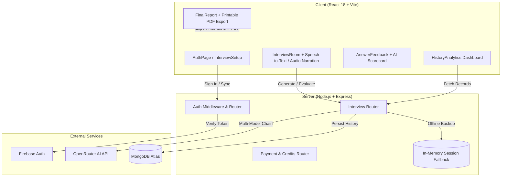

# InterviewAI 🚀
*Production-Grade MERN Stack AI Mock Interview Platform*

[-6366f1)](#-tech-stack)
[-06b6d4)](#-ai-interviewer--evaluation-engine)
[](#-authentication--security)
[](#-license)

**InterviewAI** is an intelligent, full-stack tech hiring simulator designed to help engineers practice, benchmark, and master technical screening, system design architecture, and behavioral bar raiser rounds.

> 📚 **Complete Architectural Study Guide**: For a comprehensive, step-by-step breakdown of how InterviewAI was built, how each component works, and common interview questions/answers about this architecture, check out [ARCHITECTURE_AND_STUDY_GUIDE.md](file:///c:/Mern%20Stack/InterviewAI/ARCHITECTURE_AND_STUDY_GUIDE.md).

---

## 🌟 Key Features & Platform Highlights

### 🎙️ 1. Virtual AI Interviewer Studio
- **Audio Voice Synthesis (TTS)**: Web Speech Synthesis dynamically modulates pitch and speech rate across 5 interviewer personas (*Strict*, *Friendly*, *Technical Expert*, *Professional*, *HR*).
- **Real-Time Speech-to-Text (STT)**: Microphone speech streaming directly into live transcripts.
- **Candidate Camera Mirror (PIP)**: Real-time HTML5 webcam mirror preview rendered locally with zero server video upload for maximum privacy.
- **Cadence Analytics HUD**: Live filler word counter (`um`, `uh`, `like`), speaking duration timer, and pace metrics.
- **Audio Synthesizer FX**: Native Web Audio sound effects for mic activation and evaluation milestones.

### 🎯 2. 3-Stage Multi-Round Hiring Progression Pipeline
- **Round 1: Technical Screening** — Deep dive into core mechanics, algorithms, state management, and live code walkthroughs.
- **Round 2: System Design & Architecture** — High concurrency, distributed databases, Redis caching, microservices, and sharding strategies.
- **Round 3: Behavioral & Bar Raiser** — Executive STAR framework (Situation, Task, Action, Result) communication and conflict resolution.
- **Auto-Progression**: Clearing a stage unlocks the next round automatically with overall readiness badges (*Strong Hire*, *Hire*, *Borderline*, *Needs Polish*).

### 🚀 3. 1-Click Curated Presets & Custom Configuration
- Pre-configured presets for popular engineering profiles:
  - 🚀 *MERN Stack Mastery*
  - ⚡ *Distributed Systems Architect*
  - 🎨 *Modern Frontend Specialist*
  - 👑 *Executive Bar Raiser*
- Custom role, seniority (Junior, Mid-Level, Senior), and tech stack tag selector.

### 🎙️ 3. Audio Narration & Live Voice Speech-to-Text
- **Voice Narration**: Web Speech Synthesis reads questions aloud with an interactive animated wave visualizer.
- **Voice Input**: Web Speech Recognition API allows candidates to speak their answers hands-free with live transcript updates.
- **Quick Engineering Templates**: 1-click insertion of **STAR Framework** and **Javascript Solution** code blocks.

### 📊 4. Performance Analytics & Scorecard Dashboard
- **Analytics Dashboard**: Tracks Total Completed Sessions, Mean Average Rating (/10), Personal Best Score, and Clearance Pass Rate (%).
- **Interactive Search & Category Filters**: Search past sessions by role or filter by interview type (`Technical`, `System Design`, `Behavioral`).
- **Session Deletion**: Delete past session records with backend API confirmation.

### 📄 5. PDF Print Export & Benchmark Model Solutions
- **PDF & Markdown Export**: Download detailed markdown scorecards or trigger direct printable PDF reports (`window.print()`).
- **Aggregated Candidate Insights**: Highlights candidate strengths vs. growth areas across all questions.
- **10/10 Model Answers**: Displays benchmark architectural responses for every question.

### 💳 6. Credits System & Payments Integration
- Built-in credits system (10 credits per mock interview round).
- Razorpay payment modal with live checkout and offline local testing fallback simulation.

---

## 🏗️ System Architecture



---

## 🛠️ Tech Stack

### Frontend
- **Framework**: React 18 (Vite build system)
- **UI & Icons**: Lucide React, Glassmorphism design system
- **Animations & Effects**: Canvas Confetti, CSS Wave Visualizers
- **Voice APIs**: Web Speech Synthesis API, Web Speech Recognition API
- **Auth SDK**: Firebase Authentication SDK

### Backend
- **Runtime & Framework**: Node.js, Express 5
- **Database & ORM**: MongoDB, Mongoose ODM
- **AI Integration**: OpenRouter API (`deepseek-chat`, `gemini-2.0-flash`, `llama-3.3-70b`, `mistral-small`)
- **Payments**: Razorpay Node SDK & Crypto verification
- **Authentication**: JWT (JSON Web Tokens), Cookie-Parser

---

## ⚡ Quick Start Guide

### 1. Prerequisites
- **Node.js**: `v18.0.0` or higher
- **npm**: `v9.0.0` or higher

### 2. Environment Configuration

Create `.env` in the `server/` directory:
```env
PORT=8000
MONGO_URL=mongodb+srv://<username>:<password>@cluster.mongodb.net/interviewai
OPENROUTER_API_KEY=your_openrouter_api_key
RAZORPAY_KEY_ID=your_razorpay_key_id
RAZORPAY_KEY_SECRET=your_razorpay_key_secret
JWT_SECRET=your_super_secret_jwt_key
```

Create `.env` in the `client/` directory:
```env
VITE_FIREBASE_API_KEY=your_firebase_api_key
VITE_FIREBASE_AUTH_DOMAIN=your_project.firebaseapp.com
VITE_FIREBASE_PROJECT_ID=your_project_id
VITE_FIREBASE_STORAGE_BUCKET=your_project.firebasestorage.app
VITE_FIREBASE_MESSAGING_SENDER_ID=your_sender_id
VITE_FIREBASE_APP_ID=your_app_id
VITE_FIREBASE_MEASUREMENT_ID=your_measurement_id
VITE_RAZORPAY_KEY_ID=your_razorpay_key_id
VITE_API_URL=http://localhost:8000
```

### 3. Installation & Running Locally

#### Start Backend API Server
```bash
cd server
npm install
npm run dev
```

#### Start Frontend Client Server
```bash
cd client
npm install
npm run dev
```

> **Default Local URLs**:
> - Frontend Application: `http://localhost:5173/`
> - Backend REST API: `http://localhost:8000`

---

## 📡 REST API Specification

| Method | Endpoint | Description | Auth Required |
| :--- | :--- | :--- | :--- |
| `POST` | `/api/auth/sync` | Sync user with Firebase / Register email | ❌ |
| `GET` | `/api/auth/profile` | Retrieve active user profile & AI credit balance | 🔒 Bearer JWT |
| `POST` | `/api/interview/generate` | Synthesize AI interview questions | 🔒 Bearer JWT |
| `POST` | `/api/interview/evaluate` | Evaluate candidate response in real-time | 🔒 Bearer JWT |
| `GET` | `/api/interview/history` | Retrieve user performance history & analytics | 🔒 Bearer JWT |
| `DELETE`| `/api/interview/:id` | Delete session record from history | 🔒 Bearer JWT |
| `GET` | `/api/payment/plans` | Fetch credit top-up packages | ❌ |
| `POST` | `/api/payment/create-order`| Create Razorpay payment order | 🔒 Bearer JWT |
| `POST` | `/api/payment/verify-payment`| Verify payment signature & add credits | 🔒 Bearer JWT |

---

## 🤝 Demo Account Credentials

For quick offline testing:
- **Email**: `demo@interviewai.dev`
- **Password**: `Password123!`

---

## 👨‍💻 Author & Developer

**Siddharth Saurabh**
* 🎓 Chandigarh University • 2nd Year Student
* 💻 B.E. in Computer Science & Engineering (CSE)
* 🌐 GitHub: [@Siddharth-Saurabh](https://github.com/Siddharth-Saurabh)

---

## 📜 License
This project is licensed under the **MIT License** - see the [LICENSE](file:///c:/Mern%20Stack/InterviewAI/LICENSE) file for full details.
Copyright © 2026 Siddharth Saurabh. All Rights Reserved.
